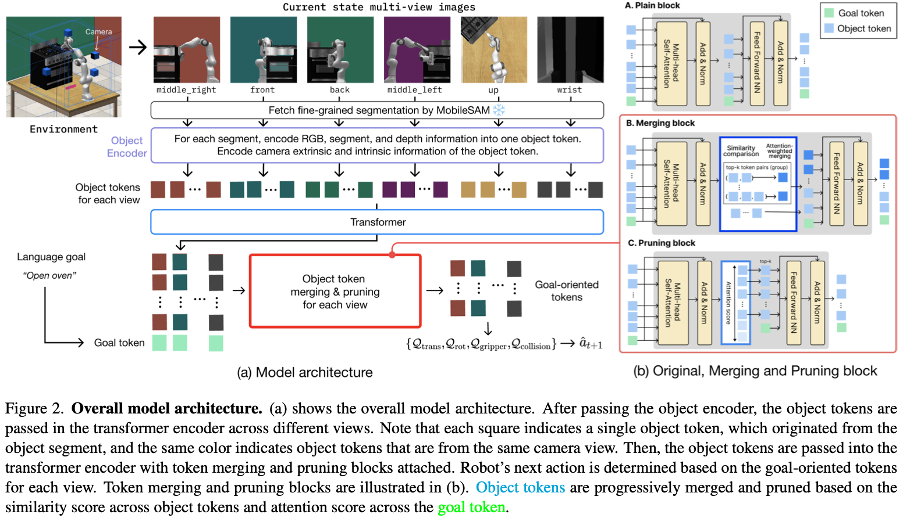

# Adaptive Visual Abstraction via Object Token Merging and Pruning for Efficient Robot Manipulation

Accepted at CVPR 2024 Workshop CoRR

[[Paper-TBD]]()
[[Github]](https://github.com/JisuHann/GoS)

Robots must efficiently manipulate objects in complex, unstructured environments. This entails identifying task-relevant objects, which consist of objects that are directly connected to the goal and constraint objects that may cause collisions during robot execution. Leveraging foundation models like Vision-Language Model or CLIP holds promise, yet they usually lack awareness of the robot's configuration and fail to recognize constraint objects, resulting in sub-optimal performance. Fine-grained object segments offer an alternative but are computationally expensive. Humans instinctively process information about objects in a manner that aligns with the demands of the task and trajectory requirements. Inspired by this, we propose integrating an architectural bias into imitation learning framework. By merging and pruning object tokens based on task relevance and importance, our method, named as GoS, reduces computational burdens and enhances task understanding, leading to higher success rates. Applied to vision-based multi-task articulated object manipulation domain, our approach shows 1.7 $\times$ higher success rate in general scenes, 1.6 $\times$ higher success rate in scenes where constraint objects exist, and 3 $\times$ less computation cost.

Note that our code base is built upon [RVT](https://robotic-view-transformer.github.io).
